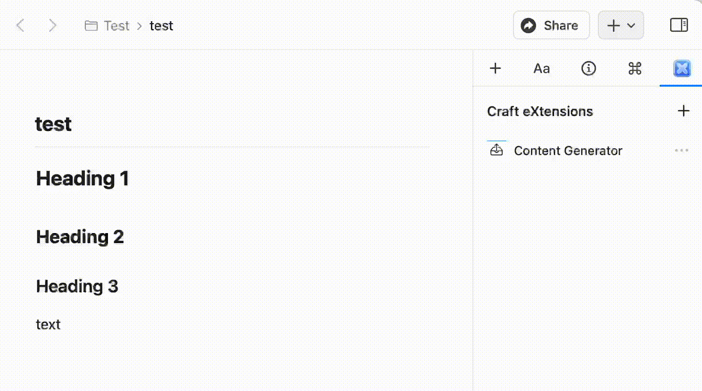

<h1></h1>
<h1 style="text-align: center;">Content Generator for Craft</h1>

## Building

Simply run `npm install` and than `npm run build` to generate the .craftX file which can be installed.
You can use `npm run dev` to test and debug in your local environment

## Using
Take a look at the Craft official [introduction](https://www.craft.do/s/OhmDYXrBwI2wZS/b/AD5AD0F2-A297-47CA-860C-817DA3CEFDB7/Craft_X_Example) to get started.

After installation, an extension named `Content Generator` will be ready to use.

To genreate the content of current page, 

1. Cilck the `Content Generator` extension.

2. Then click `Generate content`.

3. A content for the current page will be located at the very beginning of the page, right after the page title.